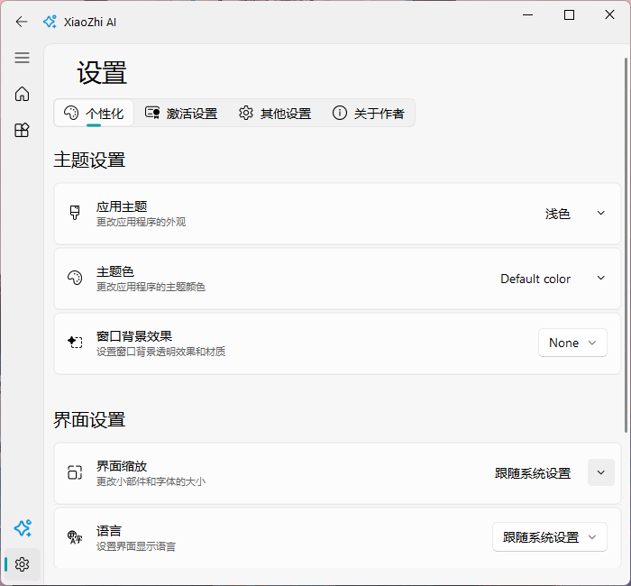
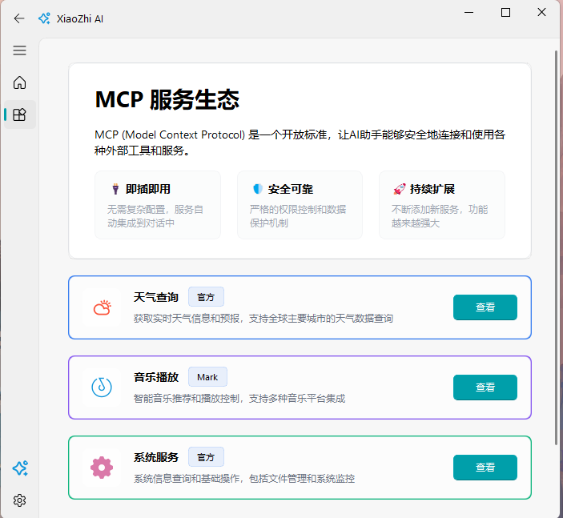
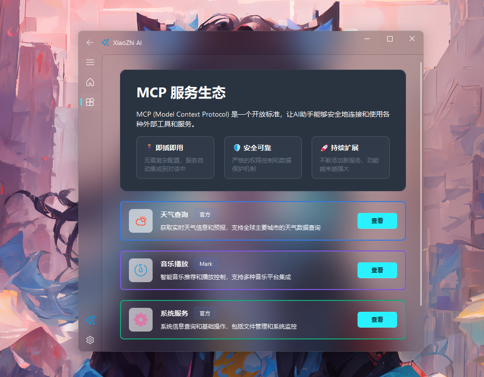
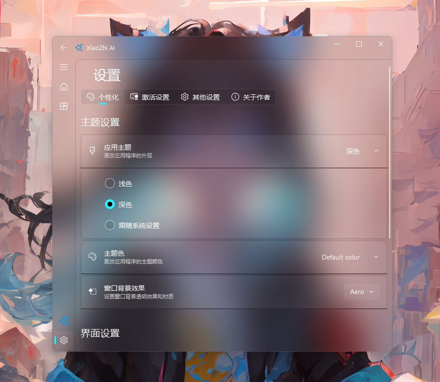

# XiaoZhi AI - 智能语音助手

<div align="center">


一个基于 Fluent Design 风格的现代化智能语音助手桌面应用程序

[](MIT-LICENSE)
[](#)
[](#)
[](#)
[](#)

</div>

## 📖 项目简介

XiaoZhi AI 是一个现代化的智能语音助手桌面应用程序，采用 Microsoft Fluent Design 设计语言，为用户提供优雅、直观的交互体验。项目基于 [py-xiaozhi](https://github.com/huangjunsen0406/py-xiaozhi) 进行二次开发，将原始项目重构为符合现代桌面应用标准的 Fluent 风格程序。

## 📸 应用截图

### 主要界面展示

<table>
  <tr>
    <td align="center" width="50%">
      
      <br><strong>主界面</strong> - 语音交互页面
    </td>
    <td align="center" width="50%">
      
      <br><strong>设置界面</strong> - 个性化配置
    </td>
  </tr>
  <tr>
    <td align="center" width="50%">
      
      <br><strong>MCP服务界面</strong>
    </td>
    <td align="center" width="50%">
      
      <br><strong>MCP服务界面(暗色)</strong> - 暗色主题
    </td>
  </tr>
</table>

### Windows 透明特效展示

#### Acrylic 亚克力效果
<table>
  <tr>
    <td align="center" width="50%">
      
      <br><strong>Acrylic 亮色主题</strong>
    </td>
    <td align="center" width="50%">
      
      <br><strong>Acrylic 暗色主题</strong>
    </td>
  </tr>
</table>
<p align="center"><em>现代化的亚克力毛玻璃效果，提供优雅的半透明视觉体验</em></p>

#### Aero 毛玻璃效果
<table>
  <tr>
    <td align="center" width="50%">
      
      <br><strong>Aero 亮色主题</strong>
    </td>
    <td align="center" width="50%">
      
      <br><strong>Aero 暗色主题</strong>
    </td>
  </tr>
</table>
<p align="center"><em>经典的 Windows Aero 毛玻璃效果，怀旧与现代的完美结合</em></p>

## ✨ 主要特性

### 🎨 现代化界面设计
- **Fluent Design**: 采用 Microsoft Fluent Design 设计语言
- **响应式布局**: 支持窗口缩放和自适应布局
- **主题切换**: 支持明暗主题无缝切换
- **Windows 透明特效**: 支持 Acrylic、Mica、Aero 等多种透明材质效果
- **流畅动画**: 丰富的过渡动画和视觉反馈

### 🎤 智能语音交互
- **语音识别**: 高精度语音转文字
- **语音合成**: 自然流畅的语音播放
- **唤醒词检测**: 支持"小智"唤醒词
- **实时对话**: 流式语音交互体验

### 🎵 音乐播放功能
- **在线搜索**: 智能搜索并播放音乐
- **播放控制**: 播放、暂停、停止、进度控制
- **歌词显示**: 实时歌词同步显示
- **本地播放列表**: 管理本地音乐文件

### 🔧 系统集成
- **系统托盘**: 最小化到系统托盘
- **全局快捷键**: 支持自定义快捷键操作
- **开机启动**: 可选择开机自动启动
- **设备激活**: 完整的设备激活和管理流程

### 🛠️ 扩展功能
- **MCP 协议**: 支持 Model Context Protocol，提供丰富的工具集成
  - 🎵 **音乐播放**: 在线搜索播放、播放控制、歌词显示、本地播放列表
  - 🌤️ **天气查询**: 基于位置的实时天气信息查询
  - 💻 **系统控制**: 应用程序启动/关闭、系统音量调节、设备状态监控
  - ⏰ **时间管理**: 倒计时器、提醒功能、定时任务
  - 📅 **日程管理**: 日历事件创建、查询、分类管理
- **插件系统**: 可扩展的工具和插件架构
- **多语言支持**: 国际化和本地化支持
- **配置管理**: 完善的配置文件管理

## 🚀 快速开始

### 系统要求

- **操作系统**: Windows 10/11 (x64)
- **Python**: 3.11 或更高版本
- **内存**: 至少 4GB RAM
- **存储**: 至少 500MB 可用空间

### 安装方式

#### 方式一：下载安装包（推荐）

1. 前往 [Releases](https://github.com/markcxx/Xiaozhi-ai/releases) 页面
2. 下载最新版本的安装包
3. 运行安装程序，按照向导完成安装
4. 启动 XiaoZhi AI 开始使用

#### 方式二：源码运行

1. **克隆仓库**
   ```bash
   git clone https://github.com/markcxx/Xiaozhi-ai.git
   cd Xiaozhi-ai
   ```

2. **创建虚拟环境**
   ```bash
   conda create -n xiaozhi python=3.11
   conda activate xiaozhi
   ```

3. **安装依赖**
   ```bash
   pip install -r requirements.txt
   ```

4. **运行程序**
   ```bash
   python Xiaozhi-ai.py
   ```

## 📱 使用指南

### 首次使用

1. **设备激活**: 首次启动需要进行设备激活
2. **权限设置**: 授予麦克风和扬声器权限
3. **音频配置**: 选择合适的输入输出设备
4. **主题选择**: 根据喜好选择明暗主题

### 基本操作

- **语音交互**: 点击麦克风按钮或使用快捷键开始对话
- **音乐播放**: 说"播放音乐"或"播放[歌曲名]"来播放音乐
- **系统控制**: 通过语音控制系统功能
- **设置调整**: 在设置界面自定义各项参数


## 🏗️ 项目架构

```
XiaoZhi-ai/
├── app/                    # 应用程序主目录
│   ├── common/            # 公共模块和工具
│   ├── components/        # UI 组件
│   ├── mcp/              # MCP 协议实现
│   ├── resource/         # 资源文件
│   ├── service/          # 核心服务
│   └── view/             # 界面视图
├── libs/                 # 第三方库
├── models/              # AI 模型文件
├── deploy.py            # 打包部署脚本
├── setup.iss           # Inno Setup 安装脚本
└── requirements.txt    # Python 依赖
```

## 🔧 开发指南

### 开发环境搭建

1. **安装开发依赖**
   ```bash
   pip install -r requirements.txt
   pip install nuitka imageio  # 用于打包
   ```

2. **构建打包**
   ```bash
   python deploy.py  # 使用 Nuitka 打包
   ```

### 贡献指南

1. Fork 本仓库
2. 创建特性分支 (`git checkout -b feature/AmazingFeature`)
3. 提交更改 (`git commit -m 'Add some AmazingFeature'`)
4. 推送到分支 (`git push origin feature/AmazingFeature`)
5. 创建 Pull Request

## 📄 许可证

本项目采用 MIT 许可证，详见 [LICENSE](LICENSE) 文件。

## 🙏 致谢

- **原始项目**: 感谢 [py-xiaozhi](https://github.com/huangjunsen0406/py-xiaozhi) 项目提供的核心功能实现
- **UI 框架**: 感谢 [qfluentwidgets](https://github.com/zhiyiYo/PyQt-Fluent-Widgets) 提供的 Fluent Design 组件
- **社区贡献**: 感谢所有为项目做出贡献的开发者和用户

## 📞 联系方式

- **作者**: markcxx
- **邮箱**: 2811016860@qq.com
- **项目主页**: https://github.com/markcxx/Xiaozhi-ai
- **问题反馈**: https://github.com/markcxx/Xiaozhi-ai/issues

## 🔄 更新日志

### v1.0.2 (2025-09-15)

📋 **版本信息**
- **版本号**: v1.0.2
- **发布日期**: 2025年9月15日
- **支持平台**: Windows 10/11 (x64)
- **国内下载链接**: [XiaozhiAI-v1.0.2-Windows-x86_64-Setup.exe](https://software.mark79.cn/XiaozhiAI-v1.0.2-Windows-x86_64-Setup.exe)

✨ **更新日志**
- 🎹 新增快捷键控制语音小智
- 🔌 添加MCP服务界面，包含服务卡片组件和详情弹窗
- 🎨 新增Windows透明特效支持（Acrylic、Mica、Aero等）
- 🖼️ 优化界面布局和视觉效果

### v1.0.1 (2025-09-14)

📋 **版本信息**
- **版本号**: v1.0.1
- **发布日期**: 2025年9月
- **支持平台**: Windows 10/11 (x64)
- **国内下载链接**: [XiaozhiAI-v1.0.1-Windows-x86_64-Setup.exe](https://software.mark79.cn/XiaozhiAI-v1.0.1-Windows-x86_64-Setup.exe)

✨ **更新日志**
- 🚀 新增开机自启动个性化设置
- 📏 新增DPI缩放个性化选项
- 🔄 新增版本检测和新版本自动更新功能
- 🔧 修复多实例运行问题

### v1.0.0 (2025-09-12)

- 🎉 首个正式版本发布
- ✨ 完整的 Fluent Design 界面重构
- 🎤 优化语音识别和合成功能
- 🎵 新增音乐播放功能
- 🔧 完善设备激活和配置管理
- 📦 提供 Windows 安装包

---

<div align="center">

**如果这个项目对您有帮助，请给我们一个 ⭐ Star！**

</div>